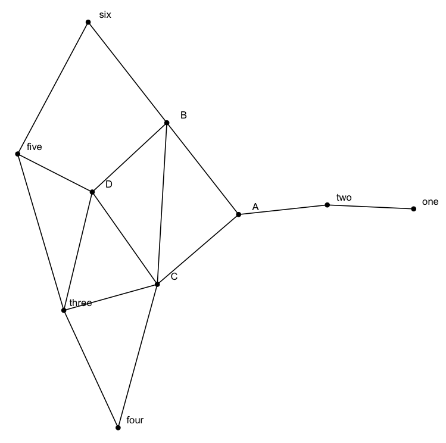
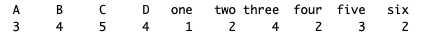
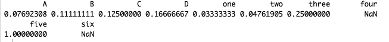
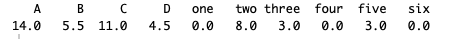

```{r setup, include=FALSE}
knitr::opts_chunk$set(echo = TRUE)
```

## Code

```
nodes <- read_csv("nodes.csv")
edges <- read_csv("edges.csv")
ig <- igraph::graph_from_data_frame(edges, vertices = nodes) %>% as_tbl_graph()
net <- ggraph(ig, layout = "stress") + geom_node_point(size = 2) + geom_node_text(aes(label = name), nudge_y = 0.05, nudge_x = 0.2) + geom_edge_link() + theme_void()
show(net)
```



B, C, and D have the highest degree centrality. A has the highest betweenness centrality.

```
degree <- degree(ig)
degree
```



```
closeness <- closeness(ig)
closeness
```



```
betweenness <- betweenness(ig)
betweenness
```



Degree centrality and betweenness provide distinct recommendations for which seat to choose. Other measurements of centrality, maybe with directionnal edges, or at the very least additional information about each node, would be required (attributes of the node).

```
ggraph(ig, "stress", bbox = 15) + geom_edge_link2(aes(edge_colour = ""), edge_width = 0.5) + geom_node_point(aes(fill = betweenness, size = degree), shape = 21) + geom_node_text(aes(label = name, size=closeness), family = "mono", repel = TRUE) + scale_edge_colour_brewer(palette = "Set1") + scale_size(range = c(2, 5), guide = "none") + theme_graph()
```