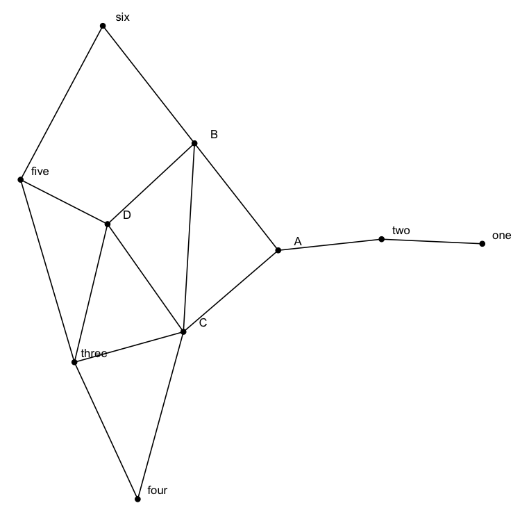

Exe. 2
================

## Code

    nodes <- read_csv("nodes.csv")
    edges <- read_csv("edges.csv")
    ig <- igraph::graph_from_data_frame(edges, vertices = nodes) %>% as_tbl_graph()
    net <- ggraph(ig, layout = "stress") + geom_node_point(size = 2) + geom_node_text(aes(label = name), nudge_y = 0.05, nudge_x = 0.2) + geom_edge_link() + theme_void()
    show(net)

B, C, and D have the highest degree centrality. A has the highest
betweenness centrality.

    degree <- degree(ig)
    degree

    closeness <- closeness(ig)
    closeness

    betweenness <- betweenness(ig)
    betweenness

Degree centrality and betweenness provide distinct recommendations for
which seat to choose. Other measurements of centrality, maybe with
directionnal edges, or at the very least additional information about
each node, would be required (attributes of the node).

    ggraph(ig, "stress", bbox = 15) + geom_edge_link2(aes(edge_colour = ""), edge_width = 0.5) + geom_node_point(aes(fill = betweenness, size = degree), shape = 21) + geom_node_text(aes(label = name, size=closeness), family = "mono", repel = TRUE) + scale_edge_colour_brewer(palette = "Set1") + scale_size(range = c(2, 5), guide = "none") + theme_graph()
